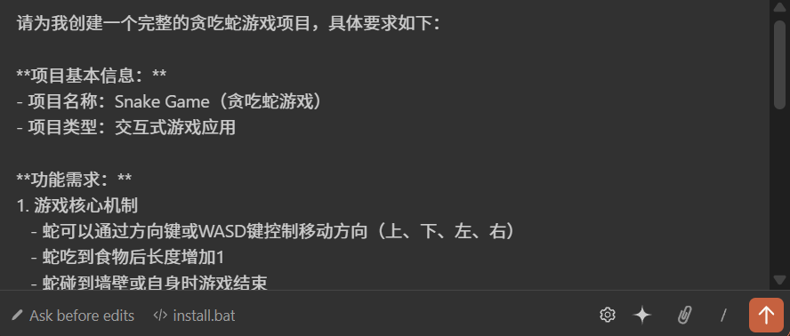
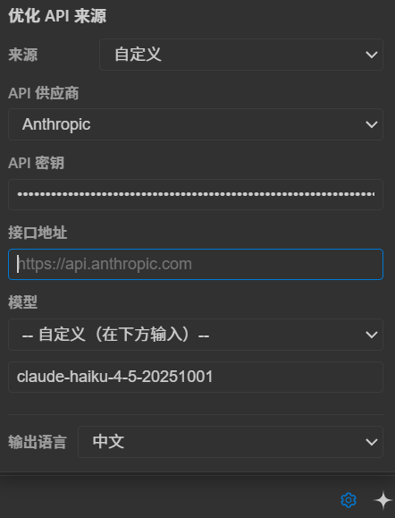
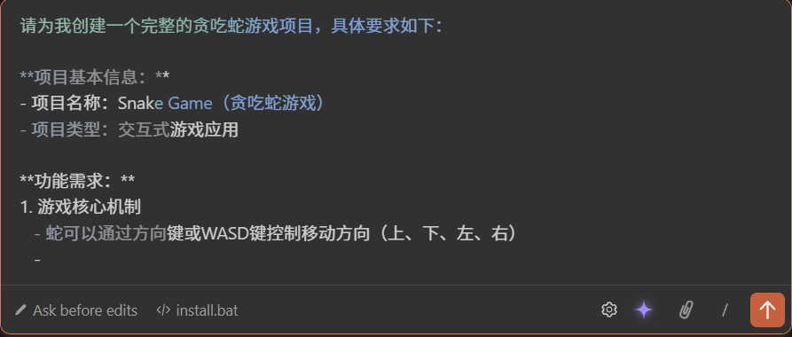

<p align="center">
  
</p>

<h1 align="center">Claude Prompt Enhance</h1>

<p align="center">
  <strong>为 Claude Code VSCode 插件注入 Prompt 优化超能力</strong>
</p>

<p align="center">
  <a href="#-核心特性">特性</a> •
  <a href="#-优化原理">原理</a> •
  <a href="#-效果展示">效果</a> •
  <a href="#-快速开始">安装</a> •
  <a href="#-使用指南">使用</a> •
  <a href="#-贡献指南">贡献</a>
</p>

<p align="center">
  
  
  
  
  
</p>

---

## 这是什么？

**Claude Prompt Enhance** 是一个轻量级补丁工具，为 [Claude Code](https://marketplace.visualstudio.com/items?itemName=anthropic.claude-code) VSCode 插件添加一键 Prompt 优化功能。

写 Prompt 不够精准？一键优化，让 AI 更懂你的意图。

支持接入 **23 种主流 AI 供应商**，使用你自己的 API Key，自由选择模型。安装只需双击一个文件。

---

## ✨ 核心特性

### 🔌 23+ API 供应商自由切换
内置 Anthropic、OpenAI、Google Gemini、DeepSeek、xAI Grok、Mistral、Groq、OpenRouter 等 23 种供应商，每个供应商预置对应模型列表，一键切换。

### ⚡ 一键 Prompt 优化
在输入框旁点击星星图标，自动将你的 Prompt 重写为结构清晰、表达精准的专业版本。支持中英文输出。

### ⚙️ 可视化设置面板
齿轮图标一键打开中文设置面板，配置供应商、模型、API Key、自定义端点、输出语言，所有设置自动持久化。

---

## 🎯 适用场景

| 场景 | 说明 |
|------|------|
| **日常开发** | 快速优化模糊的 Prompt，获得更精准的 AI 回复 |
| **Prompt 工程** | 将简单描述转化为结构化、专业的 Prompt |
| **多模型对比** | 切换不同供应商和模型，对比优化效果 |
| **团队协作** | 统一 Prompt 质量标准，提升团队 AI 使用效率 |
| **本地模型用户** | 支持 Ollama、LM Studio 等本地部署方案 |

---

## 🧠 优化原理

### 它是怎么工作的？

当你点击星星图标时，插件不是简单地把你的文字发给 AI，而是 **自动收集当前的上下文信息**，构建一个完整的优化请求：

```
你的原始 Prompt
      ↓
┌─────────────────────────────────┐
│  + 最近的对话历史（前几轮对话）    │
│  + 当前打开的文件名              │
│  + 编辑器中选中的代码片段         │
│  + 当前项目名称                  │
│  + 输出语言偏好                  │
└─────────────────────────────────┘
      ↓
   AI 模型重写优化
      ↓
  结构清晰、表达精准的专业 Prompt
```

---

## 📸 效果展示


### 一键优化 Prompt
> 点击星星图标，Prompt 自动优化为专业版本




### 设置面板
> 齿轮图标打开可视化设置，配置供应商和模型,（✨ 未配置将使用Claude默认api）



### 打字机动画
> 优化结果逐字填入，柔和蓝绿渐变效果



---

## 🚀 快速开始

### 前置条件

- [VSCode](https://code.visualstudio.com/) 已安装
- [Claude Code 插件](https://marketplace.visualstudio.com/items?itemName=anthropic.claude-code) 已安装
- [Node.js](https://nodejs.org/) 16+ 已安装

### 安装

**方法一：双击安装（推荐）**

```
1. 下载本项目
2. 双击 install.bat
3. VSCode 中 Ctrl+Shift+P → Developer: Reload Window
4. 完成！
```

**方法二：命令行安装**

```bash
git clone https://github.com/qqlzyhello/claude-prompt-enhance.git
cd claude-prompt-enhance
node install.js
```

然后在 VSCode 中 `Ctrl+Shift+P` → `Developer: Reload Window`。

### 卸载

```bash
node uninstall.js
# 或双击 uninstall.bat
```

---

## 📖 使用指南

### 基本流程

1. 在 Claude Code 输入框中输入你的 Prompt
2. 点击输入框旁的 **⭐ 星星图标** → 开始优化
3. 优化结果以打字机效果逐字填入输入框
4. 生成中再次点击星星可 **取消**，保留已生成内容

### 设置面板

点击 **⚙️ 齿轮图标** 打开设置面板：

| 选项 | 说明 |
|------|------|
| API 供应商 | 选择供应商后自动加载对应模型列表 |
| 模型 | 从预置列表选择或手动输入 |
| API Key | 填入你的 API 密钥 |
| 自定义端点 | 可选，用于代理或私有部署 |
| 输出语言 | 中文 / English |

所有设置自动保存，重启 VSCode 后依然生效。


---

## 🤝 贡献指南

欢迎贡献代码！以下是参与方式：

1. **Fork** 本仓库
2. 创建特性分支：`git checkout -b feature/your-feature`
3. 提交更改：`git commit -m 'Add some feature'`
4. 推送分支：`git push origin feature/your-feature`
5. 提交 **Pull Request**

### 贡献方向

- 🌍 添加更多 API 供应商和模型
- 🖥️ macOS / Linux 兼容性测试
- 🌐 更多语言支持（日语、韩语等）
- 🎨 UI/UX 改进
- 📝 文档完善

---

## ⭐ Star History

如果这个项目对你有帮助，请给一个 Star ⭐ 支持一下！

---

## 📄 许可证

本项目采用 [MIT License](LICENSE) 开源。

---

<p align="center">
  <sub>Made with ❤️ for the Claude Code community</sub>
</p>
